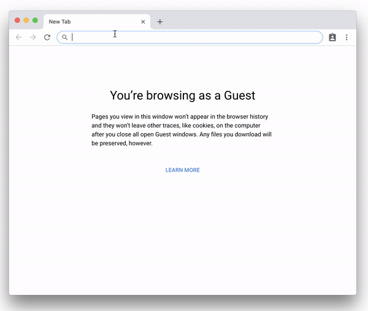

# Nipp
 

   

Mini Application Hosted on URL <https://nwtgck.github.io/nipp>  
Nipp is inspired by [itty.bitty](https://github.com/alcor/itty-bitty).

## Purpose
The main purpose is to **keep code safe in URL**. Even if the service is shutdown, the code stays alive in URL. You don't lose time and efforts to write a code. You can save a code as a bookmark easily.

## Features
* 🎒 **Portable**
  - Application is hosted only on URL!
* ⚡ **Real-time response**
  - All computation is done on client!
* ☁️ **No-server side execution**
  - Nipp site is static hosted.
  - Your code are not sent to the web server
  - [PWA] - Progressive Web Apps

## Quick Start

Try on <https://nwtgck.github.io/nipp/#Simple_Word_Count//K9YrLsjJLNFQV1DX1CvOrEoFAA==>, which counts the number of words!  
Then, you can create your own apps!

## Example Apps
* Text Length: <https://nwtgck.github.io/nipp/#Text_Length//K9YrzqxKBQA=>
* Word Count: <https://nwtgck.github.io/nipp/#Simple_Word_Count//K9YrLsjJLNFQV1DX1CvOrEoFAA==>
* Tetris: [https://nwtgck.github.io/nipp/#Tetris/es2017/bU/bSuNQF...]
* Summer Wars World Clock: [https://nwtgck.github.io/nipp/#/es2017/1Y9va1vJFcZfR59...]
* 2048 Game: [https://nwtgck.github.io/nipp/#/func_es2017,lzma/XQAAA...]

(NOTE: The original source of World Clock is located at <https://shimz.me/blog/d3-js/4360>. Thank you very much, SHIMIZU-san!)  
(NOTE: The original source of 2048 Game is located at [gabrielecirulli/2048](https://github.com/gabrielecirulli/2048). Thank you very much, the creators!)

## Ruby

Default language of Nipp is [Ruby] because [Ruby] makes us comfortable to write program!  
Nipp is highly powered by [Opal], which is a transpiler to JavaScript. Thank you very much, [Opal] project!

[Ruby]: https://www.ruby-lang.org
[Opal]: https://opalrb.com

## Also JavaScript Not Only Ruby

Nipp is not only for Ruby. JavaScript is also available. Here is Tetris on Nipp!

Try on [https://nwtgck.github.io/nipp/#Tetris/es2017/bU/bSuNQF...]
The Tetris program is from an Japanese article - 
[Commentary of Only 565 Bytes Tetris Programming](https://zapanet.info/blog/item/1125).

## URL Structure

Here is a structure of Nipp URL.  
nwtgck.github.io/nipp/#`<Page Title>`/`<Options>`/`<Compressed Code>`

* `<Page Title>` is title of your app
* `<Options>` can be `es2017`, `lzma`, `es2017,lzma`, `lzma,es2017` or etc.
* `<Compressed Code>` is code compressed by deflate (no header, no checksum) or LZAM for now and encode it by Base64

Note that `<Page Title>`, `<Options>` and <`Compressed Code`> are under URL fragment `#`. This means your code is not send to Nipp web server!

### Options

- `es2017`: Use ES2017 (default: Ruby(Opal))
- `func_es2017`: Use ES2017 but evaluated by `(new Function(...))()` not `eval()`, so output is always empty but faster
- `lzma`: Compress code by using LZMA (default: deflate)
- `click_run`: Click to run not real-time evaluation
- `promise_wait`: Wait for Promise evaluation in output

## [PWA] - Progressive Web Apps

Nipp runs even offline! Note that Nipp is available in flight mode ✈️.

## Examples of `promise_wait`

* Promise Example: [https://nwtgck.github.io/nipp/#Promise_Example/es2017,...]
* Get body by jQuery: [https://nwtgck.github.io/nipp/#Get_body_by_jQuery/es20...]
  - You can load any JavaScript from CDN

## Logo

Icons made by <a href="http://www.freepik.com" title="Freepik">Freepik</a> from <a href="https://www.flaticon.com/" title="Flaticon">www.flaticon.com</a> is licensed by <a href="http://creativecommons.org/licenses/by/3.0/" title="Creative Commons BY 3.0" target="_blank">CC 3.0 BY</a>

[PWA]: https://developers.google.com/web/progressive-web-apps

<!-- Tetris -->
[https://nwtgck.github.io/nipp/#Tetris/es2017/bU/bSuNQF...]: https://nwtgck.github.io/nipp/#Tetris/es2017/bU/bSuNQFH3vV6wGRnLMTqet9RqjpHVgoCMU9KE25KE2pzQak1JPFbGCfzAfMZ82zH/MOinWESewc/ZtXfbDeIESIdJysrzThWlMFnps9Ldc28p15o4SRIKuYCQYCgYCI5gJUkFPMBFkgqlgLsgFt4KLoPaYFWn52OiTtxnUatNlMTFZWeDKVXiugd+0XMDtcR6n/PXhY+cgIZtFkJFPJ0Dm+9hGP6jmrR2ccu6FqI/iGTzMGWmCIzb9TdPtxVlC9JzAyKI6u8zOx2bWWJTLInXn+IpIqURxJUSX28G7obrBymqgQ626S2J0FLa24M6scKqo1iWMd08r22FltUmrOLaOp3ZtFEfWHiWGsRWxvijkeYl11lrrZVO4mmVdKzxXnbfulB66/zY39nLut9sHVPP9QGF9sT3B8t6+c38AWb/xh/bbF/v7Ar/dFOwJWjY/FOywSmJDkOcZfMF+Ah8dAbdaAsNiD6fwIxzBb32iTQLk9MaTQ+yqT2N7Xk7SSCGHH6LKsY36KM6T4NO6zu/1f51Xhw3g8WrPE9zAUrGKAvj+DU6YKIzim4QDPjQdJRuil002qzC192bFmxF0wXCcABmO0e40AwzjbE3GZxXC87LKOqdYcesE7faBwrq5WsG9sNTO8fXixFGCqqooTuH8+fnLwRGc36+vzvrmspEVhV58vzz/UWl7GAildhNLda/NZXany6VxrwSHhzxmoGovtbScLO90YRrXZfrU4FZkzCK7XhrtOmXR109n5WPhCJx+qB/s3q1+6pWptn4+YsfzuS7S3izLU7fkdEgT8cj+uvxFjFY7SQQzZprRZxjGgNEUXLkq+As=

<!-- Word Clock -->
[https://nwtgck.github.io/nipp/#/es2017/1Y9va1vJFcZfR59...]: https://nwtgck.github.io/nipp/#/es2017/1Y9va1vJFcZfR59imGXZuUS+fyTb0R870CbOeiGB0A2YEgIZzcy9d+SrmcvMuZK9xi8iQwjsgtllWygJhaZQ+iY00L5omqZf5uJsPkbnSollWZJ3+7LDRZo553ee8zxxoRhIrVDfksJkdaRVpin30FENIaaVBWTRNuKaFQOhwGdGUBA7maheBFtmZA7Y6zra+tYwxzqZ6XMq5SrTS1U810kF5T7Nc6H4rVRmnFincVyr1eYJqZQwuw/u3XUqj2tbICETN/e0yTi6lWm2vxVMS7UtC4fVfwoDF6Kn+aFLcG1ATSJVB4X5Qbd2LaecS5VMn9dq10aSQ9pBURh+7rqpkEkKn57HNTtMKomPUHtzqvGJ2ggn7+PaVvBx8+Nurda3BKcAue0EAeOqb32W6YLHGTXCZ3oQ0D49CDLZswFvBk1/w2+6i9+3uI7iQjGQWhHvqIbQ/6A00AOhwIkEDT8KneK0sDaSkK5lmtFMWH8g1bI1CJFZAU0r1cGFFciCkQxw11XPG0Nq0Egqrkd7kqeAtlF7M+wuae8KmUz6G2H4UWGOssPENXnTtyITDAh2Bewt7MqN7ouJv3Y45ROhfW0g1YmheSoZ8c4HquPbKjC56DFA65cYo4GCIA/DOqq+R5faYKiy2YSY12nU59O5yuVZlsn8VypxFtrhVXGi1v9bHuf4U6C5TLHRCu5TSGd5cvcinj9LS2bX9lRlNt+jbP+Xj19wMT1upm8dglOA3HaCIJEW/ERCWvQKKwxz7oQCn+lBYFM5kN8UQfsGizY24xtxO2re2Gi5W2s9MHQUrPdEFG40m+ubMW21+Pp6izUa7ZCttzdb7c3mOmtFYaMX0uAuVXxArRW2clwZwHUUF2pq92PJQ0dTp+dmP2W2QBPhAtth4tM8F4oT7O6dBM+Hq04QlOM35cnT8uTf5fif5fiHs9O/N5r++tm//nI2/k/55Pty/O3cwETcpwCGYDBU2VibgbOHjQYKglTD7oWuo5FUXI/2JE8BBajhKg670NkVMpm1vKXmzl68Pnv3knz486m3ELNH2f49mldBp54uRM0ppHh+pDpT30cL9epgjjsoLhQDqRXx0HKqOkZAYdRk/323hyRC961W3tKB4/rybbHMsjWdUybh0C2OrsBcG3+2c3unfSfCKzALRu+LClRaiSXUsdd1tblyEJy9eH327iX58Ke/znsfUoNioxXcoznaRhZoInya50Jxgu0w6eQuNl7M61MAQ46WW+TOXVwoBlIr4qHlVHWMgMKoqYH7bhFJhO5brbylE8f15etimWVrOqdMwqHbHF2BuTb+7M7tVnT713gFZsHofVGBSiuxhDr2uq42/WYnCM5evD5797Ic/3D2/I8f3r4sn/yufPK8HH87hw2pQUXOKQi0jeJCMZBaEQ8dLaypSOmgsLvQMgIKo64er041LtF1FPqN7lIgN7ovJhrt0DcanC3yUNZR6L5H3s/NRK0VQ0vnYqMV3KeQOlO86SdC+7l7Ec+fKZKLhlbs71G2/8tlnMfVliqpezT3KYAhmOP6uThxun2rlbfCxCTM/Oh5vvnZhfHj2uqXFfCVAmGGNCNFzikI4tVRFJ5nmKOH1KABNYlUd0UMaBuNpOJ6tCd5CihAN7or6Ac6P4d3hUwmdBNdv1yKGosKIA7gt266tcoQyzTb/9Lootphh4lP81woTnCCvTm4Oj4FMASDocrG2gxwHU0fGQVBsLP0cBawPrP/yHWwh73uZQdBUJ48LcevyvGb8uTZh5Pv3v/hb+9PT3/68e1yo78RDJzPmelzu8Z1Vjo+WqhXB48khxR3EL4Rfo7ry5lUyCQFB42k4nq0J3kKKEBRuIKPZZZVkju3d9p3InwFtaZzyiQcOjr0GwvccRVmrhoE5cnTcvyqHL8pT569Pz396ce3c8CQGsQyzfYfiANA29P7l0YXuU/zXChOMLgO9haW+RTAkKPlZg+qPFG4KksVYCQV16M9yVNAAYqiVbG1gjUrvxFuJIrCq6iRkEkK1eaezji+Co3pQGaVC0yNpNkqNpNKrKWfZCN/YxUnAIRZszllUiUOXQWOtOEXsQXq2Ou62lw5CMqTp+X4VTl+U548e//8H+9//3oOsAK+Um7/kGYkLhQDqRXx0NGCOMs0238gDsAH90MGeiAUEM+PtRlQIF/s7nYGg461na+//sKbGLlgrI4irzZvs/onk5t7O9dVtRYEW5YZmQOyhm1jfHMrmL5vXm6lALntBAHjqm99Z67gcUaN8JkeBLRPD4JM9mwwten3bdDwo9BvfiysjSSkay4RzYT1B1I54uKyGtesmEz2ND/0pVLC7D64dxdto8e1LTtMKtb91h5PTKMhNci65vkYM4KC2MlE9SJ4qotdRAfbS3qu9HjSmF9K81wofiuVGSfWTf4X

<!-- 2048 Game -->
[https://nwtgck.github.io/nipp/#/func_es2017,lzma/XQAAA...]: https://nwtgck.github.io/nipp/#/func_es2017,lzma/XQAAAAIPNgAAAAAAAAAyG8iOnuhLzEy3bM1DyFSaPEscooIx+jz9PrDY6Y2I7CQvNJ0iVb1dizYg9eAvpqxbOKVOea8ZZJfSo3HCPHVTfazuQVqEdruSheowjYqiLeGoX90gqksxFE9omZdxXR3pp/tbITiMHKcoGsF0OdWmdzvoA25G+7BBzocTd4wwZm7nu4brk6jEe5CwIL8y4uixPm4a5b8LPrLq84A5dntgWBeIKuNqNAJVepE7Nkz7lOF3BMbLUaU2kfyKOS0hw6+mPC12kh4mTuZ6IpHmpGvgpH4j5HYmWEGfB3/rLx28jk9Q939M/IRCJoVFtnw9kg65E7lclVU1MQg+/fA1qB+dEUuYQVfOf7vDhqctQsEV2dG47tgPOYNw5CKMxqbJNrbiS97ZPwsgo72yWisnj+VOaojACE//W8OwyD5hQr0O93ngOt0rvINfzF39Y/weWAhy5iFx/d1+XCYA8gYRLPpZQ+Ro0Hohfjdk4FPhyX0Kg96P4KM7JdXZxlLIChzt4oyB2nv+mNkWYn6zJP9CtqLND8nauvZeSqnjGbXYYBsAYCORcawjOURcAMFh9VUk3z3caLHdWVwsuK7b26AJvpGbpIienfSIrU+9SVo5ePJufFQIUXryb/G/AoXhoGSLIVb8rKwGuWGCKCvmI4qCl3eGhYZLy309bb0L1pX1KE0BzuoWvdU5RB1N02p9WzbJdjwQ5MId24s2vEqUPR/ATp7ehgoZfq0Qm1oKd8COV1iayCkn0II7tBjW14GiRhnKJ70Xp35wMUosVRrFw9MSaUQtPpxLaJUyReg+gzoSSOo2GcI4bQxZMMeAC0QBr7ANeDXCQznUHG22NJzWbc+jkbylr/Exd3YIqWCqyLErflZ/+VVHGONF8pDXHfpKPo625QNUoHCxxvHzUp+LUKc4dGgOQcWwv44w43TnPh/cAX43Xa+a1rGzCGWkbaY/GTvqg8IxLUjrn2f/NljQ9aQqiTDTwuJigV76uFAtvKp8EIUUTiAmj7d5c6f1ZhQJrgpNsOWDVd4PE57rjbMSzJ+C0NzvbO6F2pIisCIpa50WlSc8ybIQvntsu9VkaNdGVg3sPgJRHn0DoIJw4pdTsiPspu3lsMiH1QEBvRdC1RWqhIFrWLRlxdYO+4zzM/RVqAqthAF1zJiDNvyUDRNKyIABErol8Xnvaq7vydHHz7OyWRqyfnUMGxaq6dTRXh4Gl4Yq2RLuNBm1H4hl6RGKkFI6Mhaf25Ieu9cvAUIzmxbCcXwdPB8ZfrZSCfYrJ9Qlth+q3LqZWZmQsD58HYXq3a2Tad7b/9GtJTtgnjlCXXYZRotGh99oMsqcEKSramAg+d1j1Q4vhHw01WyjM/XeN/EfNuOlKY5Qx2DEokOHq59GsiFXQvF2EM9oHq/K1ZG/HxlZSrg9TXRtYARao/8w756SS477PxPfGW88EM0yCwG9GjQJC5Ez57TuR59yxLwm2QcedKz53QLRHuCk6HIGPJh9V4enzjXGwpgcIYVxxo0BtgFDMbg9PwggqHTq41popu/ycBSKixpweKr6p8fC1Seg21TV5/atu3c9dz7lAhVCyoLfA4BNnL2CPNfE8uXRTPRfxBKxDCLmBNhB7afVUVufGbkLjB1L0bw6LR+vrD8SF2Prb6tJcU2qz3igYy2d206KAe6oeGni3Eu55jM3BULaiyn64z/EMhHuM2OMJ6e5u0CG29IGhaI4tk4u+wk9jJoMBzE+jxdiLjQ+1q6HrCEPYLapENhglCTSuG45n+lM72hRAJB7fTjHG/lZ3LTzROgsh8nUxvJ7Pze1ojssjL1J/AxxvYoy460aOq5SgBPW5OkxotdFH/UMO1nsEQFl5mCehwcTAg0tWp+IHGKAn0KUgYZtdSc0qUj9V0Pej6vxMEjHk3bCaov3gfSJh45WrwNewoSBaj/iQLh6xBrPlEF5sx7yNRtV8ifIf+/NwF5xoiawUMF+BYwup23gLsVOtOj7/oIFWpYYl40OGyZkg6v+lG95Bx9yFSRinyV34xpMz2vQLOUAQF/UuYiGSVoyyXMZxhCOoKNweKvnJNoDK9KqLZ7DgfFJrW0zRCdvPfO8YqjQZIWlMoOChglICaXlOghaYIdDoK5+KiOF2680uQ+4RUu/xPwWXRjSJllbMfj8oLjgulLcGNGsK76gs627ZXrEzGLPiGzJTMPQ2fd0B1aHpbh0QJX12FlnB3WwgTFmFXMelNi0tSJjD22b9JJK9L/sw6UpXNLDm97o0W21YkkvB7ZdGO5WJlWoGMIOzdkL6oiwkguLEnwsDWvNkChGxZ6mIJ525kVhC2ChtjRYbRfCXRVWc+FnHC9rriZo5X3iUHbqpCEbWx4pnmMyvpDZ95LPNnPF79Aj4v2ODpUJ+ltcDZsiF4WaC5w/iwXJwlYYz6JTxXLsxr2nZoC+GGkvG5J8Y6k/8UJx6BcYopFqW4au2FZnPMmPtJiSBj6WIs5ZN+Hq6LtimsKzPTvYLuQp/T/mEd8eGcL2ZK1mlNs3FrEO+JVt+8ZBWqFPGk9tzrRKLivC2pENI46IwAijPEK+uOLchcDOXm12X7wnXelzstO8zRV7W8qhzQojzyOIxaneuN4cg04k90FSoQNZ4AaQM93wGrsWlcuw3GQ+NQBYFUTs38kAeTE4iLb04iOIbNfV0f78IQoKLHlhthiisO1V3/s7iKnqA7zzRWtGJVsutdx7ZU1Qkfxe7zOOQ47I2D2Ns9BJFZXvD3bds5RBGzCwuwpra1foFSfVqv3ZpCYLaOYhiwBm8dUn/3VUD627qB+G1AgVc3T+uYgRVYFwZpppzWp6fM+dYM9eHuVGwBnmsqCPA32nh1cVzHW77i2rnriW88Oe1sck2VlGI9ylNRpDXK6eeYXOfy7f/NK9p8A+HpIVi1RYLRyqiWPtwX/6TYuUU9e3ddeaUWlEJ47IEUg2AmT5Fsg/yET8vpyH6zXThKGyjOt9NdAtPhXMuai0U1wli5s7+DkBSHTeBGpGmivfCXLD1gtfz19DUY8w39sKdrMxnq2Y08r9hrwknqhsVgV+BHP0BCDKB5TJBOwPIb6hrwGMvaH6kQkIC2rx9FLX3p/0qnnpEXJfpTXnun7fqhdvXW+StA6rgeMrLVyUasJQAfKEIZQMu1E20QavTa38ESR8Rfn5WoXqz4ZFTFCbWv1qnD5BpGL5UpSYBu4/Z5LYbpaQ0cSUVJoo7ZaSQKb0hTTL867xcYeIAOFHLjl1Ve2LNyDdI0IFq5A8KYD23nL6nzqffhnyzJ2QJuI9VaFGES4mFB3fbUx7uIhGx9xaYwWOc4tgKwIQoODVw4JYm9579q6PkVnshwiU/I1X+moUXU76Na6A1724BhZxEtdRg5HUOTAWbFDzJWCSyPnsYAlUzP6TSABn7Cc+2gJyI5B7h7VDfcYbNrY5ECmXokFPEnpPrVM7illNYPmmOlfYEf0+TzTO3lB8gdHj+2U/qKo4DY7or5sHngJ+/3XrHI7/y8rozVHmv8hoxfU97h2YnCaN3UvblOtkTbf3RcDbZQ89FsY4lvv/8+o5askCu8s+IWxiQBsxeoO8YeLl8MKboY+kDqb0XPtAQTy6b8Wm711WdX0wOFDU97Ky/n0jgJbymhCjFGThF0PXw1DibU4Nsh28pP21XA+23XSrnwXXH6LEA/4EAkE07KkI0y37sxvWgYq1MXoec8yjC/WJKgL2KtdY0lqaLLZsyZ3cFMDIEiZTB3Sd7d9Jey7WpZYIjlvRNRbgjlo8gzNV2s4FZ0dat2WdWIzMzYIkpCbYIjfM7aZ+aVsP6SIZeIiEQNCh1/iSJlEy+BPPZaQAJy89QCXChCvt+UH6YHZSo1iFEpO2jBeq8tLd9Xcj07XhyQv5IcCQyzhPQ1MXm9AGIv3Lx9Wnc4a2xLVmaFu/vRW1ncNuPbAYhGOeLl82isCV/S7H2oc/dEN7VYEumokNtC9JytuFi0PwygHroeg+/prrcLIXhEwWts/6w0mMvFEc7PPNPgWKPQ2Qw0iDIdIsnQV1O8xOPgumAgYscFPjEOB2el9nK7Sn377j3du+8RsGSfU/rmJ1+WmVwTGyCi+k78Li9qQgtGzHQexts7VcT18fsZFxVweewSZD3zdJwNObyjYcdv74Zh6HjCI4KO5wwCflLk11k5cpoaUf71cj+2DHcwcmG8X+dZB840zkuzaQJsVlWAFtiqae0C6A1VgzjAEau3SlP8xzqmvMzUe34Edp2WcokjWnKZyUbPG/zDJKThQpzEvOurwnJYLn+FW3hc+FS+QKbRIP/Dzd5I14tgwp0MJI7di+5GEHAmavIb44oaT5tE38CFxs2Y7vBqW3sv3gTJwQhTHWOqMZDlp2clFWCORJCqlBW1tKMU/z9usIIfxqZSF69pPSVK05wptMGU2baOIP5WfJJJF/MXpyVuncE7VeGr4Zlhc8gPra4U9zWveHrBVq23Zt2tRdZlKIniHBwyYyfq6fxVWYzj1xV/Lr7DP4eaEzL7Gty6OXTqW5vVYoZEEUjYuo+7gcJr4dQrlWVbrfrTJITwiCzrFoM+o6qoGuiB+B25bUF9TAM4farLZAAYEbcJpJWIv2Itd0PFzPQTyK/4jZGjZ7obcOseQHcuh6FO2AlPcwOAO2Y6y7Lc0WgPqxOOGB9+j+vpUCLDqvRV86bM3a3EyjteWAM3BrvnZtdRczGSKAhUv5y+FRDihX5QEbhin05dWBLwEbmXkwd9JjQARC3Bsx1vdvzimuLiOYXqIIEDyqy3SwlvY++qwWZ8VG56ruEbrmv8CSfK1nzfdwPRnOVc11PQ9U+7d8UE+hdulXAo8/LougiO33qhtA1sGsWLTvSXzyvUQRX/Beb+skQ5wxeh9duE5MkVpvSNxLrFUvsmtKsL7+KEM75S2yurpMdrOu6RLLdOZGVE+OHDz4/ktKDDj8YYUHCGVm38l0yd0/HufvBfuaL14Vcg5pJ5qlO8s09q5SBe/VJCYgQPqK4u1t5Rm/nPiqEAaP5h4kTnWeAc2inz3mjUDYRcTOwCirf8OakJhPR3WIingL7XmKX2NviXtK5vdPuSSnFHXH1cHErAUpEpjZEb07QS/PFMPttgaRBFSXWoXIso3U0/wf2yX8UYEsrO+mqESds0XH6H7VJ9sUtpAiylevPYEu3ANQ/6SsZ60+pGJcJacfVoDHv8guof5MGNtNxM5nGzX1Gd+uRelvwgosR5r1V0AZgXZeOTQ7b+Fh4vlH8HD0cLP+WPyfJj5khyGxGUjG6Gkeowzm8RMG2fzIEZaCri9dkwpO/RJUXHSX0mXBza0clA4GNpyhI4G/1p67hLyXy0Ll3qnqTssfHmH7FyZW8whi9bitEOXxKqXSQw/VmRNxK1U2hxwsBSj6g5Jn1l2Tx0q1x54S7qxmBxcKZVkUX0JnkEiRukkZKkv+kD4z+i7FW82w31MDn5H/pwPmgQ0qZI15AAuDC32Gx2J6KBtgBKRPy05ZnETS6tOvVE++4nzHpykolv/9417v

<!-- Promise Example -->
[https://nwtgck.github.io/nipp/#Promise_Example/es2017,...]: https://nwtgck.github.io/nipp/#Promise_Example/es2017,promise_wait/y0stVwgoys/NLE7V0ChKLc7PKUvVUShKzUpNLtG0tavmUgCC4tSSkMzc1PzSEg0NuCAIQDVoKGWk5uTk6yiU5xflpCikAc2DGaqopGkNVl6ro2BkYGAA5NVqWgMA

<!-- Get body by jQuery -->
[https://nwtgck.github.io/nipp/#Get_body_by_jQuery/es20...]: https://nwtgck.github.io/nipp/#Get_body_by_jQuery/es2017,promise_wait/ZU/NSsQwEL73KYbiIQVNkL0p3YuIID2oxQeIySxNSZOaTF2K9N1N2roezCHJfH8zIwQ0Xmp4buEU/ADvb01xmpwi4x3YxLQqmJFYDKqC7wLSCUhTcODwDC/JYiIyFjB6+4XXiexRUQX1cVfno7yLBHFNghq0V9OAjrgKKAkfLeaKlZugrO4vxg3hqXmypfsf412eMZH7AH+CS5MOpeZyHNHph85YzTbr3mVJ71IUTMbZKWBVfdzGFgKanNy/ThjmFZJnaQhyv3ZNYGVHNMY7IZTXyPvPrOTKD2L73hz4gd/yaM3AB+N4H39XS+FPSPDh9QwdDXYFlXeR1jKtc8XKzJYVzwDbfQFpCm6zLFVGfwA=
